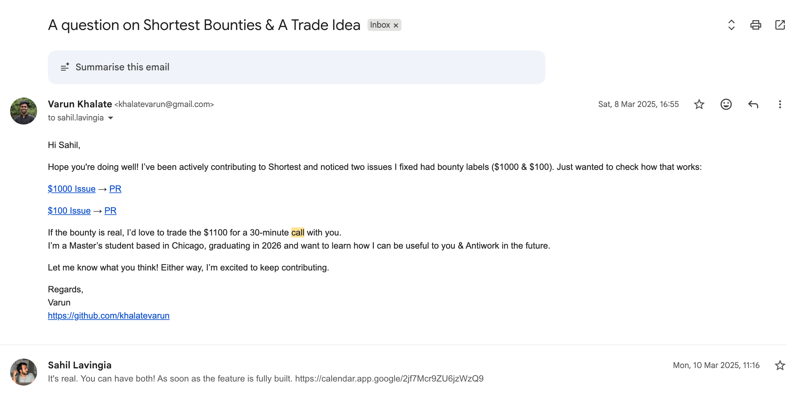

During my December 2024 winter break at UIC, I had some free time between semesters. No internship lined up yet, no particular plan, just a gap in the schedule and an itch to do something useful with it. So I did what any self-respecting CS grad student would do: I went exploring on GitHub.

That's when I came across **Shortest**, an AI-powered natural language end-to-end testing framework. It was brand new, open source, and built by **Antiwork**, the company behind Gumroad.

And Gumroad meant **Sahil Lavingia**.

I'd been following Sahil for a few years at that point. His journey with Gumroad was something I found genuinely fascinating. He built it, almost lost it, wrote *The Minimalist Entrepreneur*, and then quietly started building a portfolio of open-source tools. I remember watching his interviews on YouTube and thinking about how differently he approached building companies compared to the typical VC-funded playbook.

So when Shortest popped up on my feed, I saw it for what it was: an opportunity to get on his radar.

## Starting from zero

Here's the thing. I had zero experience building CLI tools. The project was a completely new environment for me. AI-powered testing? Never touched it. But GitHub Copilot had just gotten ChatGPT-3 models integrated into its chat, and I figured I could lean on that to ramp up faster.

I started reading through the codebase, trying to understand the architecture, picking up issues. Some were small fixes, some were more involved. The repo had bounty labels on issues like $100, $500, even $1,000 for certain features. I wasn't thinking about the money at that point. I just wanted to ship good PRs and learn.

From January through March 2025, I kept contributing. I implemented core CLI workflows like [`shortest init`, selective test runs, and line-number execution](https://github.com/antiwork/shortest/pulls?q=is%3Apr+is%3Aclosed+author%3Akhalatevarun). I hardened the AI API reliability by preventing non-retriable retries and added token-usage telemetry. I set up ESLint, pre-commit hooks with Husky and lint-staged, pruned noisy tests. Over time, I authored **12 PRs**.

Two of those PRs happened to close issues that had bounty labels. One worth **$1,000** and another worth **$100**.

## Shooting my shot

After a couple months of consistent contributions, I decided to shoot my shot. I wrote Sahil a cold email.

No long pitch. No corporate speak. I kept it short and direct. I told him I'd been actively contributing to Shortest, mentioned the two bounty-labeled issues I'd fixed, linked the issues and PRs, and then made an unconventional offer:

> *"If the bounty is real, I'd love to trade the $1,100 for a 30-minute call with you."*

I told him I was a Master's student based in Chicago graduating in 2026, and that I wanted to learn how I could be useful to him and Antiwork in the future. Signed off with my GitHub profile.

That was it. No five-paragraph essay about my life story. No resume dump. Just proof of work and a simple ask.

Two days later, Sahil replied:

> *"It's real. You can have both."*

And he dropped a Calendly link.

## The call

We got on a 17-minute Google Meet call on March 14, 2025. Here are some of the things that stood out from the conversation:

### On how Antiwork thinks about hiring

Sahil was clear that Antiwork doesn't have a traditional hiring pipeline. He talked about using equity bounties on GitHub and Flexile to build a distributed, decentralized workforce of contributors. The core team stays small and handles scoping, design, and product direction. Outside contributors handle a lot of the engineering.

His reasoning? He doesn't want to run a big company. If AI tools can keep the team small while still shipping everything he wants to build, that's the ideal setup. He mentioned how most of a founder's time gets eaten by managing people, hiring, and recruiting, and he'd rather just build.

### On what makes an open-source contributor stand out

I asked him directly: how does a contributor actually stand out? He didn't sugarcoat it.

> *"They just have to be really good."*

He said the bar is high. An open-source contributor needs to be able to open a PR that's so good the response is just "looks awesome, ship it." That kind of quality comes with experience and deep understanding of the product and its users. He acknowledged that the distribution of contributors follows a power law. Most won't have their stuff merged, and that's fine. The whole point is finding the few who are genuinely exceptional.

### On where new grads should focus

I asked him what he'd do if he were a grad student right now. His answer surprised me a little. He said to think about **biotech, robotics, chemistry, and material science**, the fields where we're still very early. He was less bullish on B2B SaaS as an exciting frontier, noting that a lot of it will eventually be vibe-coded. It won't go to zero since businesses still need tools, but the startup energy, in his view, is shifting toward physical-world problems.

He also said something that stuck with me: the fundamental premise hasn't changed since the iPhone era. Use whatever new technology has come out recently to build products that are easy to distribute using the internet. Fifteen years ago it was mobile apps. Now it's AI. The playbook is the same.

### On the 10x engineer (now 100x)

Sahil talked about how the "10x engineer" meme has been around forever, but with AI tools like Devin and Copilot, you now have people who are 100x, maybe even approaching 1000x. This makes the bar for a small team even higher, because one experienced person with the right tools can do the work of a much larger team. It also means the competition for roles at lean companies like Antiwork is intense.

### On getting into Antiwork

He laid out roughly two paths. First, earn enough bounties through contributing to open-source projects. Essentially do the job before you get the job. Second, be someone he already knows socially who happens to be really good at something specific, like a consultant or advisor relationship.

He also floated a third option I didn't expect: if you build something cool that fits within the Antiwork ecosystem, they might acquire the project and bring it (and you) into the portfolio.

### On Shortest's trajectory

I asked about the enterprise adoption angle. He'd mentioned in a contributor meeting that industry experts had starred the repo and he was considering reaching out to organizations. He said they were seeing weekly downloads climb but the product wasn't ready yet. The plan was to get it to a point where it was good enough for internal use, add a self-hosted option, and then start doing outreach.

## What I took away

The whole interaction, from first PR to cold email to call, reinforced a few things I already believed but hadn't fully tested:

**Proof of work beats everything.** I didn't have a warm intro. I didn't know anyone at Antiwork. What I had was a GitHub history of merged PRs. That was the credibility. The cold email wrote itself because I'd already done the work.

**Make the ask unusual.** Trading $1,100 in bounties for a 30-minute call is a weird ask. That's the point. It signals that you value the conversation more than the money, and it makes the email impossible to skim past.

**Keep it short.** My email was probably 80 words. No fluff. If you've done the work, you don't need to sell yourself. Just point at the evidence and make it easy to say yes.

**Timing matters.** I didn't email Sahil on day one. I waited until I had a meaningful body of contributions. Patience made the pitch credible.
