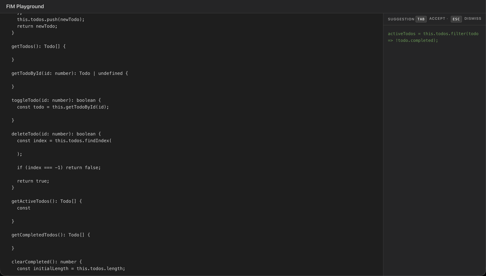

# Introduction

Code editors we use daily are usually desktop apps. Because of that, it never really crossed my mind to think about how features like code completion actually work under the hood. It just works, you accept the suggestion and move on.

That changed when I was using [Modal](https://modal.com)'s notebook to work on an assignment for my CUDA course. Unlike a desktop editor, it runs in the browser.


> I've been reverse engineering [Modal](https://modal.com)'s UI, UX and architecture for a while now. I study everything they build and try to understand the decisions behind it. When I noticed the autocomplete suggestions working in a way that felt interesting, I did what I always do. I opened the Chrome DevTools network tab.

# What I Found in the Network Tab

The completions API request payload looked roughly like this:

```json
{
  "cellId": "d674e9a7-03bd-4150-bc43-d53b1fe91951",
  "cellContext": [
    "# Welcome to Modal notebooks!\n\nWrite Python code and collaborate in real time..."
  ],
  "prefix": "%%writefile reductionSUM.cu\n#include <stdio.h>\n#include <iostream>\n#include <chrono>\n#include <cuda_runtime.h>\n\n#define BLOCK_SIZE 8\n\n__global__ void reductionKernel(int* buffer, int* globalResult, int N){\n\n  __shared__ int sharedBuffer[BLOCK_SIZE];\n\n\n  int threadIndexG = blockIdx.x * blockDim.x + threadIdx.x;\n  int threadIndexL = threadIdx.x;\n\n  if (threadIndexG < N) {\n    ",
  "suffix": "\n  } else {\n    sharedBuffer[threadIndexL] = 0;\n  }"
}
```

And the response:

```json
{
  "completion": "`sharedBuffer[threadIndexL] = buffer[threadIndexG];`"
}
```

Two fields: `prefix` for everything before the cursor, `suffix` for everything after. At first it seemed weird. Why send the suffix at all?

After some ChatGPT-ing and Claude-ing I came across the term: **Fill-in-the-Middle (FIM)**.

# The FIM Pattern

> Instead of training a model to predict `P(middle | prefix)`, FIM models are trained on `P(middle | prefix, suffix)`. During training, chunks of code are split into three parts and shuffled into the `<prefix>...<suffix>...<middle>` format so the model learns this task explicitly.

The standard next-token prediction approach, where you give the model code and it continues from the end, completely breaks down when you're writing in the middle of a file. The model has no idea what comes after the cursor, so it might complete in a direction that conflicts with what's already there.

FIM solves this by giving the model the full picture: what came before, what comes after, fill in what's missing.

After reading more about it I realized it's actually quite a popular protocol. There are models trained specifically for this, like Codex, DeepSeek Coder, Code Llama all support FIM natively. But I wanted to try this with just any general-purpose model, so I built a small demo.

# Building the Demo



The goal wasn't a polished UI. It was to understand the API payload and protocol. A textarea, a panel on the right showing suggestions, Tab to accept, Esc to dismiss. That's it for the UI. The interesting parts are everything else.

### 1. The API Payload

When the user pauses typing, I split the editor content at the cursor position:

```ts
const prefix = code.slice(0, cursorPosition)
const suffix = code.slice(cursorPosition)
```

Then I send both to the model as a chat completion:

```ts
{
  model: "llama-3.3-70b-versatile",
  messages: [
    { role: "system", content: SYSTEM_PROMPT },
    { role: "user",   content: buildUserMessage(prefix, suffix) }
  ],
  max_tokens: 200,
  temperature: 0.2
}
```

Low temperature because this is code. You want deterministic, not creative.

### 2. Indicating the Cursor Position

The user message does two things. First, it gives the model the full file context with FIM tags. Then it zooms into the *immediate* context around the cursor, because for large files you want the model focused on the right spot.

```ts
function buildUserMessage(prefix: string, suffix: string) {
  const beforeCursor = prefix.split('\n').slice(-2).join('\n')
  const afterCursor  = suffix.split('\n').slice(0, 2).join('\n')

  return [
    `<prefix>${prefix}</prefix>[CURSOR]<suffix>${suffix}</suffix>`,
    `The [CURSOR] marker is where you must insert. Immediate context around [CURSOR]:`,
    `...${beforeCursor}[CURSOR]${afterCursor}...`,
  ].join('\n\n')
}
```

The `[CURSOR]` marker makes the insertion point explicit. Without it, the model can get confused about exactly where the prefix ends and the suffix begins.

### 3. The System Prompt

This is where most of the work is. Chat models are trained to be helpful, so without clear instructions, they'll try to complete the entire file, repeat context, add comments, explain themselves. None of that is what you want.

```
You are a TypeScript code completion assistant.

The cursor position is marked with [CURSOR] in the user message.
Complete ONLY what belongs at that exact position.

Rules:
- Only complete what is at the very end of the prefix.
- The suffix already exists. Do NOT repeat or overlap with it.
- If nothing is missing at the cursor, return empty.
- No completion is often the best choice. Do not force a suggestion.
- Output ONLY the insertion text, no explanation, no markdown.
```

That last rule, *no completion is often the best choice*, matters a lot. Without it the model tries to suggest something on every pause, even when the cursor is between two tokens that are already complete. You end up with noise.

### 4. Using Artifacts for Parsing

Instead of relying on markdown code fences (which models sometimes forget or wrap inconsistently), I defined my own XML tag:

```
Respond with this format only:
<complete>insertion text here</complete>
```

Parsing becomes trivial:

```ts
function parseCompletion(raw: string): string | null {
  const match = raw.match(/<complete>([\s\S]*?)<\/complete>/)
  return match ? match[1].trim() : null
}
```

If the tag is missing, you get null. If it's empty (`<complete></complete>`), you get an empty string, which means no suggestion. Clean, deterministic, no fragile string parsing.

This is what Anthropic calls **artifacts**. They use structured XML tags to extract specific pieces from a model response. This is particularly useful when you want a single precise output rather than prose.

### 5. Debouncing and Aborting In-flight Requests

Two things that matter a lot in practice:

**Debounce the API call.** You don't want a request firing on every keystroke. I debounce by 300ms, so the model only gets called after the user pauses.

**Abort in-flight requests.** If the user types something new before the previous request completes, cancel it. Otherwise you get stale suggestions showing up out of order.

```ts
let controller: AbortController | null = null

function fetchCompletion(prefix: string, suffix: string) {
  if (controller) controller.abort()
  controller = new AbortController()

  return fetch('/api/complete', {
    method: 'POST',
    signal: controller.signal,
    body: JSON.stringify({ prefix, suffix })
  })
}
```

Without abort logic, a slow request from three keystrokes ago can overwrite a fresher suggestion. It's a small thing but it makes the experience noticeably cleaner.

# Conclusion

The interesting thing about FIM isn't the model, it's the protocol. What makes code completion feel magical is **how you frame the problem**: splitting the document at the cursor, packaging both halves as context, constraining the output format so the insertion is always precise.

You could apply this with any capable LLM. The model doesn't need a special FIM fine-tune. It just needs a clear contract: here is what came before, here is what comes after, give me only what's missing.

That's it for this one, see you in the next one :)
