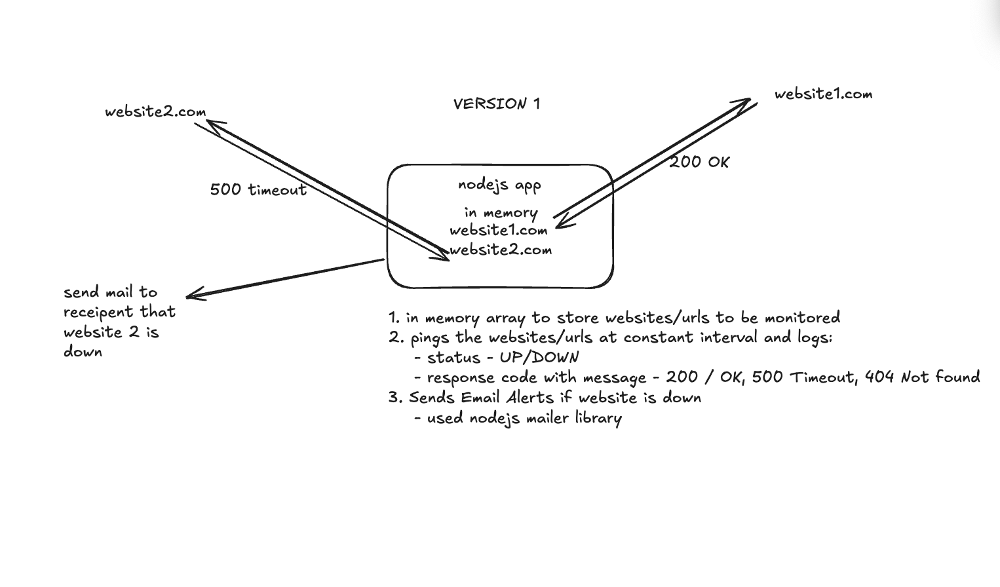
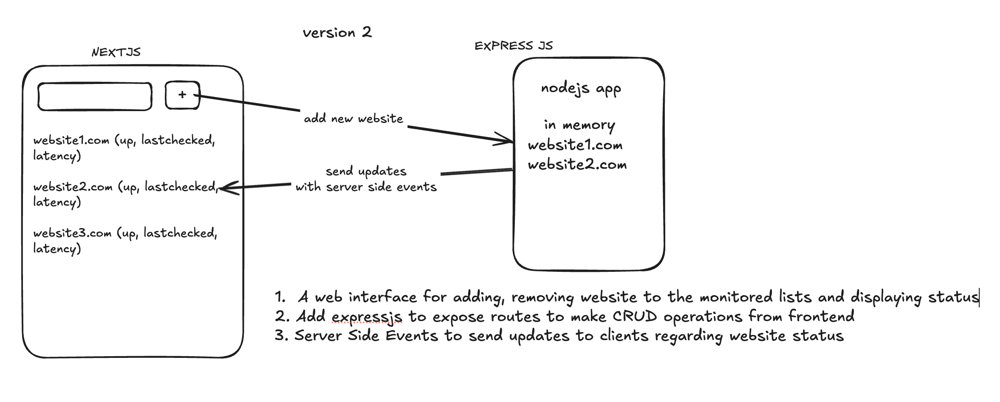
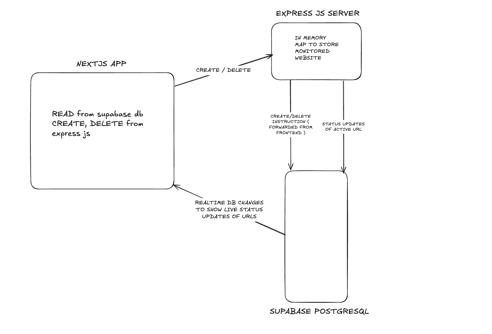
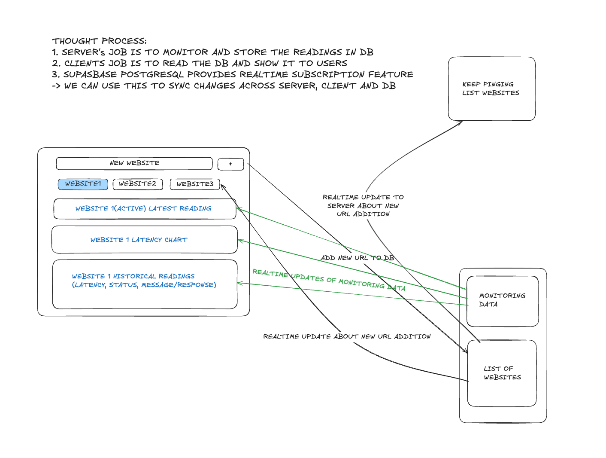

## Features

- **Real-time Monitoring**: Track website status and performance in real-time
- **Custom Monitoring Intervals**: Set different monitoring frequencies for each website
- **Interactive Dashboard**: View detailed performance metrics and status history
- **Data Visualization**: 
  - Real-time latency graphs
  - Status indicators with color coding
  - Historical performance data
- **Data Export**: Export monitoring data in CSV format with flexible date range selection
- **Status Classifications**:
  - UP: Website is responding normally
  - DOWN: Website is not accessible
  - DELAYED: Response time consistently exceeding threshold
  - PENDING: Initial monitoring state

## Tech Stack

- **Frontend**: Next.js with React
- **Backend**: Supabase
- **Database**: PostgreSQL (via Supabase)
- **Charts**: Recharts
- **UI Components**: shadcn/ui
- **Icons**: Lucide React
- **Date Handling**: date-fns

# Diary

## v1 - nodejs app



### Inspiration

- [11 years old blog](https://blog.ragingflame.co.za/2013/2/14/roll-out-your-own-uptime-monitor-with-nodejs)

### Learnings

- How NodeJS balances concurrency?
    - JS being a single threaded language, it still supports async programming by the event driven architecture of NodeJS
    - Timers Fire Independently, but Callbacks Are Sequentially Executed
        - Multiple HTTP requests can occur simultaneously without interfering with each other.
        - When responses arrive, their callbacks are queued and executed sequentially by the event loop.
    - The famous “chef in the kitchen” analogy to understand Nodejs concurrency

# v2 - add web interface



### Learnings

- Why Server Side Events?
    - a lightweight and efficient mechanism to deliver real-time updates
    - frontend is expecting the updates from backend at regular interval which is a one way communication which make it a perfect usecase for sse
    - SSE maintains a persistent HTTP connection, which is more efficient than repeatedly polling the server for updates.
        
        ```jsx
        res.setHeader('Content-Type', 'text/event-stream');
        res.setHeader('Cache-Control', 'no-cache');
        res.setHeader('Connection', 'keep-alive');
        
        ```
        
- When do we add expressjs framework to our nodejs app?
    - Express makes it easy to create and maintain RESTful APIs.
    - Express helps manage the increased complexity like multiple endpoints and SSE
    - Helps integrate middleware like `cors` for cross-origin requests and `express.json()` for parsing incoming JSON payloads.

# v3.0 - add db, sync with db, deploy the app



## Learning

- Serverless vs Server
    - This is the first project I built which required a server which needs to work continuously on its own *( i.e. keep pinging the websites to be monitored and store the result in db)*.
    - Initially I deployed the expressjs as a VERCEL function without realising its serverless nature.
    - Problem - The deployed server behaved inconsistently:
        
        → the monitored websites map was not being maintained when a new website was being added
        
        → the supabase db was updated with only few statuses, hardly 3-4
        
        - Persistent in-memory storage
            - The fact that expressjs itself was maintaining a state of its own in map(data structure) to keep a track of the monitored websites was completely against the serverless nature of Vercel.
        - Long-lived processes
            - Monitoring websites with `setInterval` relies on a process running continuously. Serverless functions terminate after executing their logic, so they cannot support such continuous operations.
    - Solution
        - Deploy the server using a PAAS ( Platform as a service ) called Render.
        - Problem with render free plan - ***shuts down*** after 15 mins of inactivity
            - Temporary solution - write a cron job that keeps pinging the server on a separate endpoint that returns a simple “OK” to avoid inactivity

# v4.0 - fixing bad architecture and multiple monitoring



### Learning

1. Multiple Source of Truths
2. Subscription to realtime changes for all website at the same time
3. Do I really need an ExpressJS server?

# v4.1 - adding export data feature

# v4.2 - improving performance and security

→ frontend performance using subscription channel effectively

→ db performance and security using stored procedures 